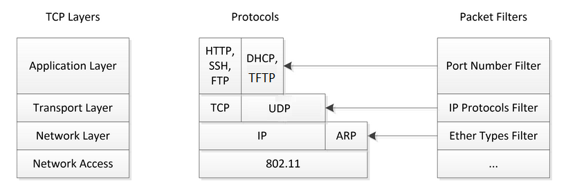
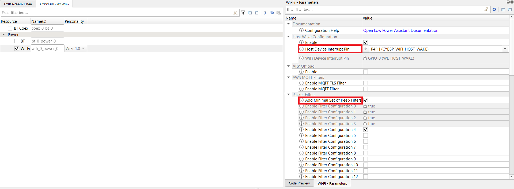
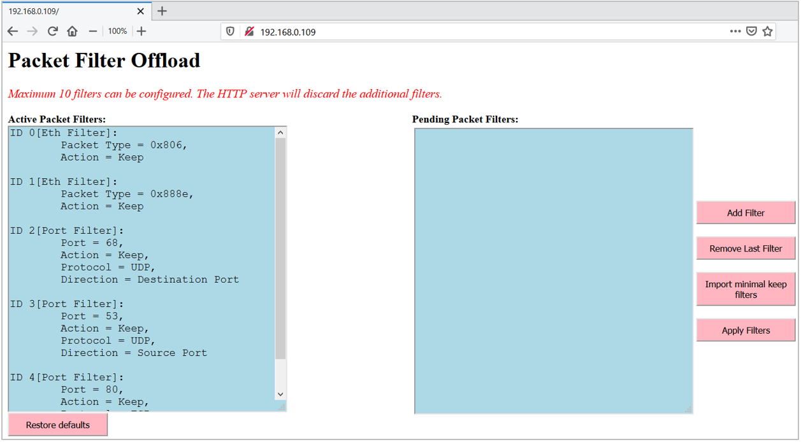
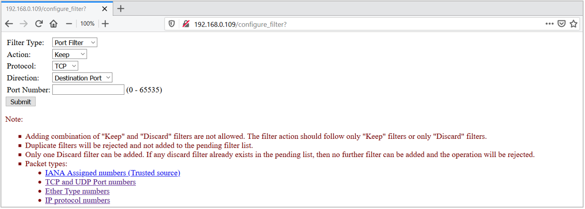
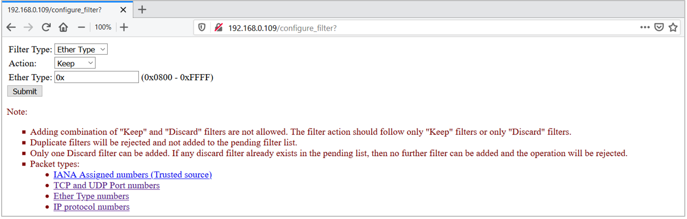

# PSoC 6 MCU: WLAN Packet Filter Offload

 This code example demonstrates the Packet Filter Offload functionality offered by the Cypress Wi-Fi chips.

## Requirements

- [Mbed CLI](https://github.com/ARMmbed/mbed-cli)
- Device Configurator - installed as part of [ModusToolbox™ IDE](https://www.cypress.com/products/modustoolbox-software-environment) v2.0
- [ARPing Network Tool](https://www.elifulkerson.com/projects/arp-ping.php) for Windows OS
- Programming Language: C++
- Associated Parts: All [PSoC® 6 MCU](http://www.cypress.com/PSoC6) parts

## Supported Kits

- CY8CPROTO-062-4343W [PSoC 6 Wi-Fi BT Prototyping Kit](https://www.cypress.com/CY8CPROTO-062-4343W) (CY8CPROTO_062_4343W)
- CY8CKIT-062-WiFi-BT [PSoC 6 WiFi-BT Pioneer Kit](https://www.cypress.com/CY8CKIT-062-WiFi-BT) (CY8CKIT_062_WIFI_BT)
- CY8CKIT-062S2-43012 [PSoC 62S2 Wi-Fi BT Pioneer Kit](https://www.cypress.com/CY8CKIT-062S2-43012) (CY8CKIT_062S2_43012)

## Hardware Setup

This example uses the kit’s default configuration. See the kit guide to ensure that the kit is configured correctly.

**Note**: The PSoC 6 BLE Pioneer kit and the PSoC 6 WiFi-BT Pioneer kit ship with KitProg2 installed. Before using this code example, make sure that the kit is upgraded to KitProg3. The tool and instructions are available in the [Firmware Loader](https://github.com/cypresssemiconductorco/Firmware-loader) GitHub repository. If you do not upgrade, you will see an error like “unable to find CMSIS-DAP device” or “KitProg firmware is out of date”.

## Software Setup

Install a terminal emulator such as [Tera Term](https://ttssh2.osdn.jp/index.html.en) or [PuTTY](https://www.putty.org/) if you don't have any.

This example requires [Device Configurator Tool](https://www.cypress.com/ModusToolboxDeviceConfig), which is installed as part of [ModusToolbox™ IDE](https://www.cypress.com/products/modustoolbox-software-environment) v2.0. Refer to the [ModusToolbox Installation Guide](http://www.cypress.com/ModusToolboxInstallGuide) for installation instructions.

## Using the Code Example in Mbed CLI Tools

Mbed CLI commands are used to import the code example and compile. See [Working with Mbed CLI web page](https://os.mbed.com/docs/mbed-os/v5.14/tools/working-with-mbed-cli.html).

1. Import the code example into your Mbed OS directory using the following command:
   ```
   mbed import https://github.com/cypresssemiconductorco/mbed-os-example-wlan-offload-packet-filter
   ```

2. Change working directory to the code example folder:
    ```
    cd mbed-os-example-wlan-offload-packet-filter
    ```
3. Open *mbed_app.json* and edit the Wi-Fi SSID and password to match your AP settings.

4. Connect the board to your PC using the provided USB cable through the USB connector.

5. Put the kit in DAPLink mode to allow programming from Mbed CLI. See [Firmware-Loader](https://github.com/cypresssemiconductorco/Firmware-loader) to learn how to update the firmware and switch to DAPLink mode.

6. Compile the code and program the target board:
     ```   
     mbed compile -m <TARGET> -t <TOOLCHAIN> --flash --sterm
     ```
     For example, to build for the target CY8CKIT_062S2_43012 with GCC_ARM toolchain, use the following command:
     ```
     mbed compile -m CY8CKIT_062S2_43012 -t GCC_ARM --flash --sterm
     ```
**Note:** With the --sterm option, Mbed CLI opens a new terminal with 9600-8N1 as the setting after programming completes. Do not use this option if you want to connect using another serial terminal application such as PuTTY or Tera Term.

## Operation
1. After programming, the application starts automatically. Ensure that the following appears in the application startup logs:

    ```
    SSID: <SSID_NAME>, Security: 4

    Connecting to <SSID_NAME>...
    WLAN MAC Address : <WLAN MAC ADDR>
    WLAN Firmware    : wl0: <WLAN INFO>
    WLAN CLM         : API: <CLM INFO>
    WHD VERSION      : <WHD VERSION INFO>
    MAC     : <WLAN MAC ADDR>
    Netmask : 255.255.255.0
    Gateway : 192.168.43.116
    RSSI    : -60

    IP Addr : 192.168.43.37

    HTTP server started successfully. Go to the webpage http://192.168.43.37
    ```
2. Access the HTTP web page through the URL `http://192.168.43.37` as printed on the serial terminal:

3. To get quickly started with the demo, jump to the [Verify Packet Filter Offload](#verify-packet-filter-offload) section.

## Design and Implementation
The Packet Filter helps to filter out unwanted network packets from reaching the host MCU (PSoC 6 MCU) and waking it. This helps the host to stay in deep sleep for longer periods of time. WLAN network packets can be filtered based on the port (at application layer in OSI model), IP protocol type (transport layer), or Ether Type (network layer).

The Internet Assigned Numbers Authority (IANA) is responsible for maintaining the official assignments of port numbers, protocol numbers, or Ether type for WLAN packets. See the [IANA Protocols Registry](https://www.iana.org/protocols) for information on protocol numbers.

[Figure 1](#figure-1-packet-filters-supported) shows the packet filters Supported, based on a standard IP Stack.

##### Figure 1. Packet Filters Supported


For more details on the implementation, see the [Low Power Assistant Reference Manual](https://cypresssemiconductorco.github.io/lpa/lpa_api_reference_manual/html/index.html#group_lpa_p2_packet_filter).

The application does the following when the kit is powered up:

1. Initializes Wi-Fi as a STA (Station) interface.

2. Initializes the OLM (Offload Manager) with the configuration present in the *GeneratedSources* folder inside *COMPONENT_CUSTOM_DESIGN_MODUS/TARGET_\<kit>*, where the source code for the feature is generated by the Device Configurator tool in the ModusToolbox IDE. The Offload Manager will be initialized based on the GeneratedSources configuration.

3. Connects to the AP (Access Point) with the Wi-Fi credentials in the *mbed_app.json* file.

4. Starts the HTTP web server.

This application uses a "Ping-Pong" buffer logic. One of the buffers is used to hold *Active packet filters* configuration that is applied to the WLAN device. The other buffer is used to keep track of the *Pending packet filters* which you can add to the list and apply the configuration.

##### Figure 2. Ping Pong Buffer


### Configure Packet Filters

Use the Cypress Device Configurator tool to configure packet filters and the host MCU wake pin. By default, Mbed OS is shipped with a *design.modus* file that can be used to configure the kit's peripherals from scratch as per application requirement.

The Device Configurator tool is a part of Cypress' ModusToolBox (MTB) IDE. Install ModusToolBox from the [ModusToolbox web page](https://www.cypress.com/products/modustoolbox-software-environment). The *design.modus* file can only be opened via the Device Configurator tool.

For this Packet Filter Offload application demonstration, a pre-configured *design.modus* file is provided for each target *TARGET_\<kit>*. This has all the necessary settings enabled for the feature to work. We recommend that you go through the following steps. It provides additional information on how to access the design.modus file and configure packet filters using the ModusToolbox Device Configurator tool.

**Note:**
```
The steps in this section are already handled with this application. They are provided only for informational purposes.
```

1. Open the Device Configurator tool from the ModusToolbox installation directory: *<mtb_install_dir>\ModusToolbox\tools_2.0\device-configurator*

2. Click **File** > **Open** and open *design.modus* file in the example directory for the respective kit, in *\<code-example-installed-dir\>/COMPONENT_CUSTOM_DESIGN_MODUS/TARGET_\<kit>/design.modus*.

If the *design.modus* file does not open, and the error message *No device support library path provided* appears, browse to the *psoc6pdl* folder inside the *mbed-os* directory as shown in [Figure 4](#figure-4). The path should look like as follows: *mbed-os-example-wlan-offload-packet-filter\mbed-os\targets\TARGET_Cypress\TARGET_PSOC6\psoc6pdl*. This is because the *design.modus* file will update its path to the PDL directory when it is opened for the first time.

##### Figure 3. Error Opening design.modus File


##### Figure 4. Set Path to psoc6pdl


3. Configure Packet Filter Offload by following the steps provided in the
    [Quick Start Guide](https://cypresssemiconductorco.github.io/lpa/lpa_api_reference_manual/html/index.html#group_lpa_p2_packet_filter_qsg).
    This is also available locally: *\<code-example-installed-dir\>/lpa/docs/lpa_api_reference_manual.html*.

4. On the **PSoC6 MCU Pins** tab of the Device Configurator tool, do the following:

    - **CY8CKIT_062_WIFI_BT**
        - Enable the Host wake pin *P2[7]* and name it *CYBSP_WIFI_HOST_WAKE*.
        - In the **Parameters** pane, change the following.
            - *Drive Mode*: Analog High-Z. Input buffer off.
            - *Initial Drive State*: High(1).
            - *Interrupt Trigger Type*: Rising Edge.
        

    - **CY8CKIT_062S2_43012**
        - Enable the Host wake pin *P4[1]* and name it *CYBSP_WIFI_HOST_WAKE*.
        - In the **Parameters** pane, change the following.
            - *Drive Mode*: Analog High-Z. Input buffer off.
            - *Initial Drive State*: High(1).
            - *Interrupt Trigger Type*: Rising Edge.
        

    - **CY8CPROTO_062_4343W**
        - Enable the Host wake pin *P0[4]* and name it *CYBSP_WIFI_HOST_WAKE*.
        - In the **Parameters** pane, change the following.
            - *Drive Mode*: Analog High-Z. Input buffer off.
            - *Initial Drive State*: High(1).
            - *Interrupt Trigger Type*: Rising Edge.
        

5. Go to the **WiFi** tab and configure the fields as follows. The following configuration is applicable to all the [supported kits](#supported-kits) in this document. [Figure 5](#figure-5-wi-fi-configuration) and [Figure 6](#figure-6-packet-filter-configuration) show the Packet Filter Offload configuration for CY8CKIT_062S2_43012.
     
     1. Enable Host Wake Configuration and set **Host Device Interrupt Pin** to **CYBSP_WIFI_HOST_WAKE**.
     
     2. Select **Add Minimal Set of Keep Filters**. This adds minimum required packet filters for a basic network application to work. Here, packets filters configured to be allowed are *ARP*, *802.1X* (for LAN and WLAN authentication), *DHCP*, and *DNS* packets.
     
     3. In addition to these, you need the HTTP packet filter. Because this code example uses HTTP Web server as the user interface, add **HTTP port 80** as the packet filter as shown in [Figure 5](#figure-5-wi-fi-configuration).

   ##### Figure 5. Wi-Fi Configuration
   

   ##### Figure 6. Packet Filter Configuration
   

6. Click **File** > **Save**. The generated source files *cycfg_connectivity_wifi.c* and *cycfg_connectivity_wifi.h* will be available under the *GeneratedSource* folder in the same location where the *design.modus* file was opened.

### Minimum Allowed Packet Types

This section lists the minimum packet types that filters must allow,  and their importance.

When using keep filters, you must allow enough packets through for networking protocols to work properly. For example, the PSoC6 MCU running the application must be able to join a network, get a DHCP address, run ARP and possibly share network security keys. Not creating enough *Keep* filters to allow all these type of packets through will prevent the MCU from joining the network. A reasonable minimal set of *Keep* filters are:

    Keep, EtherType 0x806                    # Allow ARP
    Keep, EtherType 0x888e                   # Allow 802_1X Security
    Keep, Port Filter: UDP, Dest Port 68     # Allow DHCP
    Keep, Port Filter: UDP, Source Port 53   # Allow DNS

This code example uses an HTTP web server to host the web page for user access, so you need an additional packet filter to allow HTTP packets to reach the host MCU for its service: 

    Keep, Port Filter: TCP, Dest Port 80     # Allow HTTP

For more information on low-power system design, see [AN227910](http://www.cypress.com/AN227910). This application note explains how the low-power is acheived using various techniques in which the packet filter is one of them. Refer to the section 3.3 (Host Offloads to WLAN Device) in the document.

## Verify Packet Filter Offload

Do the following to verify the Packet filter offload feature:

1. Open a web browser and enter the IP address `(http://<ip_address>/)` as shown in the serial terminal. The home page of the kit will look like as shown in [Figure 8](#Figure-7-Packet-Filter-Home-Web-Page).

##### Figure 7. Packet Filter Home Web Page


2. The home page contains **Active Packet Filters** and **Pending Packet Filters** section.
   
   ### Active Packet Filters:
   - Contains packet filters that are applied to the WLAN device and are currently active.
   
   - Click **Restore defaults** to restore to default packet filter configuration. The default configuration is the one selected from the Device Configurator tool.
   
   ### Pending Packet Filters:
   - Contains packet filters that are not applied to the WLAN device yet and are in pending state.
   
   - Click **Add Filter**  to add a new packet filter into the pending filter list. This redirects to another web page with an interface to add a new packet filter to the pending filter list.

     ##### Figure 8. Port Type Filter
     

     ##### Figure 9. Eth Type Filter
     

     ##### Figure 10. IP Type Filter
     
   
   - Click **Remove Last Filter** to remove the last applied packet filter from the pending list.
   
   - Click **Import minimal keep filters** to import the default packet filter configuration into the pending list. This pulls the configuration from the Device Configurator-generated settings described in the [Configure Packet Filters](#configure-packet-filters) section.

   - Once the configuration is finalized in the pending list, click **Apply Filters** to apply the pending packet filters into the WLAN device. 
   
     The web page will go down temporarily as the kit reconnects to the AP to apply new packet filter configuration. This will overwrite the current configuration; the WLAN will be active with the new packet filter list.
   
   - Refresh the home webpage to see if the **Active Packet Filters** section has updated with the new configuration.

3. Minimum keep filters that are configured via the Device Configurator tool are *ARP*, *DHCP*, *802.1X*, *DNS*, and *HTTP* packets in this application demonstration. This means that the kit will respond to only these network packets and toss (or discard) any other packet types trying to reach the host. The requesting device will time out waiting for response from the kit.

4. To quickly test the packet filter, send a `ping` request to the kit IP address. Because the *ping* packet (ICMP type) is not filtered, the ping response from the kit will time out as the packet will get tossed by the kit. Now, send an ARP request packet to the kit. The kit will send a ARP response back with the valid Host MAC address. This verifies that the packet filter is working.

   Terminal commands for reference:
   ```
   ping <Kit IP Address>
   ```
   Linux:
   ```
   arping -I <Wi-Fi Interface> <Target IP Address>
   ```
   Windows: Install ARPing network tool from the link given in [requirements](#requirements) section.
   ```
   arp-ping.exe <Target IP Address>
   ```

5. Add the **Ping** packet filter to verify that the peer device in the network is able to ping the kit successfully. To do so, click **Add Filter** on the home web page and configure as follows, and click **Submit**.

   ```
   Filter Type:   IP Type
   Action     :   Keep
   IP Protocol:   1
   ```

6. Check that the new filter is added to the pending list. Click **Apply Filters**.

7. Now, any device in the same network as the kit can send a ping request and get a response. To verify this, send the `ping <kit IP address>` command from the command window.

**Note**:
```
1. The code example disables the default device configuration provided in *mbed-os\targets\TARGET_Cypress\TARGET_PSOC6\TARGET\COMPONENT_BSP_DESIGN_MODUS* with the one provided in *COMPONENT_CUSTOM_DESIGN_MODUS/TARGET_<kit>/*.
The custom configuration disables the Phase-locked Loop (PLL) and the HF clock to unused peripherals like audio/USB, and configures the Buck regulator instead of the Low Dropout (LDO) regulator to power the PSoC 6 MCU device. This configuration reduces the current consumed by the PSoC 6 MCU device in active state with a small increase in deep sleep current. Enable the peripherals using Device Configurator.
</br>

2. Click **Apply Filters** or **Restore defaults** on the HTTP web page to reassociate the kit with the AP. Because the application always tries to enter deep sleep power mode, it does not get time to load the HTTP web page on the client. Refresh the web page on the client to wake the host (PSoC 6 MCU) from deep sleep to load the HTTP web page.
```

## Reference Documents

|                  Application Notes                           |                        Description                           |
| :----------------------------------------------------------- | :----------------------------------------------------------- |
| [AN227640](https://cypresssemiconductorco.github.io/cypress-mbed-os-docs/) – Getting Started with PSoC 6 and CYW43xxx in Mbed | Describes PSoC 6 MCU devices and how to build your first application with Mbed.|
| [AN227910](http://www.cypress.com/AN227910) – AN227910 - Low-Power System Design with CYW43012 and PSoC 6 MCU
 | Describes how to implement a low-power system design.        |
| **Code Examples**                                            |                                                              |
| [Using Mbed OS](https://github.com/cypresssemiconductorco?q=mbed-os-example%20NOT%20Deprecated) |
| [Using ModusToolbox IDE](https://github.com/cypresssemiconductorco/Code-Examples-for-ModusToolbox-Software) | [Using PSoC Creator](https://www.cypress.com/documentation/code-examples/psoc-6-mcu-code-examples) |
| **Device Documentation**                                     |                                                              |
| [PSoC 6 MCU Datasheets](http://www.cypress.com/search/all?f[0]=meta_type%3Atechnical_documents&f[1]=resource_meta_type%3A575&f[2]=field_related_products%3A114026) | [PSoC 6 Technical Reference Manuals](https://www.cypress.com/search/all/PSoC%206%20Technical%20Reference%20Manual?f[0]=meta_type%3Atechnical_documents&f[1]=resource_meta_type%3A583) |
| **Development Kits**                                         | Buy at Cypress.com                                     |
| [CY8CKIT-062S2-43012 PSoC 62S2 WiFi-BT Pioneer Kit](http://www.cypress.com/CY8CKIT-062-BLE) | [CY8CKIT-062-WiFi-BT PSoC 6   WiFi-BT Pioneer Kit](http://www.cypress.com/CY8CKIT-062-WiFi-BT) |
| [CY8CPROTO-062-4343W   PSoC 6 Wi-Fi BT Prototyping Kit](http://www.cypress.com/cy8cproto-062-4343w) |                                                              |
| **Libraries**                                                |                                                              |
| PSoC 6 Peripheral Driver Library and docs                    | [psoc6pdl](https://github.com/cypresssemiconductorco/psoc6pdl) on GitHub |
| Cypress Hardware Abstraction Layer Library and docs          | [psoc6hal](https://github.com/cypresssemiconductorco/psoc6hal) on GitHub |
| **Middleware**                                               | Middleware libraries are distributed on GitHub               |
| Low Power Assistant (LPA)                    | [lpa](https://github.com/cypresssemiconductorco/lpa) on GitHub |
| HTTP Server                                    | [http-server](https://github.com/cypresssemiconductorco/http-server) on GitHub |
| Connectivity-Utilities                                    | [connectivity-utilities](https://github.com/cypresssemiconductorco/connectivity-utilities) on GitHub |
| Links to all PSoC 6 MCU Middleware                               | [psoc6-middleware](https://github.com/cypresssemiconductorco/psoc6-middleware) on GitHub |
| **Tools**                                                    |                                                              |
| [ModusToolbox   IDE](http://www.cypress.com/modustoolbox)    | The Cypress IDE for PSoC 6 and IoT designers                 |
| [PSoC Creator](https://www.cypress.com/products/psoc-creator-integrated-design-environment-ide) | The Cypress IDE for PSoC and FM0+ development                |

Cypress provides a wealth of data at www.cypress.com to help you to select the right device, and quickly and effectively integrate the device into your design.

For PSoC 6 MCU devices, see [How to Design with PSoC 6 MCU - KBA223067](https://community.cypress.com/docs/DOC-14644) in the Cypress community.

## Low Power Assistant: Related Documents
 - [LPA Middleware RELEASE.md](https://github.com/cypresssemiconductorco/lpa/blob/master/README.md)
 - [LPA Middleware API Reference Guide](https://cypresssemiconductorco.github.io/lpa/lpa_api_reference_manual/html/index.html)
 - [ModusToolbox Software Environment, Quick Start Guide, Documentation, and Videos](https://www.cypress.com/products/modustoolbox-software-environment)
 - [LPA Middleware Code Example for MBED OS](https://github.com/cypresssemiconductorco)
 - [ModusToolbox Device Configurator Tool Guide](https://www.cypress.com/file/455241/download)

## Document History

Document Title: CE229166 - PSoC 6 MCU: WLAN Packet Filter Offload

| Revision |                 Description of Change              |
| -------- | -------------------------------------------------- |
|    1.0.0   |   Initial release.<br/>Tested with Mbed OS v5.14.2 and LPA middleware v1.0.0 |
|    1.1.0   |   Modified folder structure. |

------

All other trademarks or registered trademarks referenced herein are the property of their respective owners.


-------------------------------------------------------------------------------

© Cypress Semiconductor Corporation, 2019-2020. This document is the property of Cypress Semiconductor Corporation and its subsidiaries ("Cypress"). This document, including any software or firmware included or referenced in this document ("Software"), is owned by Cypress under the intellectual property laws and treaties of the United States and other countries worldwide. Cypress reserves all rights under such laws and treaties and does not, except as specifically stated in this paragraph, grant any license under its patents, copyrights, trademarks, or other intellectual property rights. If the Software is not accompanied by a license agreement and you do not otherwise have a written agreement with Cypress governing the use of the Software, then Cypress hereby grants you a personal, non-exclusive, nontransferable license (without the right to sublicense) (1) under its copyright rights in the Software (a) for Software provided in source code form, to modify and reproduce the Software solely for use with Cypress hardware products, only internally within your organization, and (b) to distribute the Software in binary code form externally to end users (either directly or indirectly through resellers and distributors), solely for use on Cypress hardware product units, and (2) under those claims of Cypress's patents that are infringed by the Software (as provided by Cypress, unmodified) to make, use, distribute, and import the Software solely for use with Cypress hardware products. Any other use, reproduction, modification, translation, or compilation of the Software is prohibited.
TO THE EXTENT PERMITTED BY APPLICABLE LAW, CYPRESS MAKES NO WARRANTY OF ANY KIND, EXPRESS OR IMPLIED, WITH REGARD TO THIS DOCUMENT OR ANY SOFTWARE OR ACCOMPANYING HARDWARE, INCLUDING, BUT NOT LIMITED TO, THE IMPLIED WARRANTIES OF MERCHANTABILITY AND FITNESS FOR A PARTICULAR PURPOSE. No computing device can be absolutely secure. Therefore, despite security measures implemented in Cypress hardware or software products, Cypress shall have no liability arising out of any security breach, such as unauthorized access to or use of a Cypress product. CYPRESS DOES NOT REPRESENT, WARRANT, OR GUARANTEE THAT CYPRESS PRODUCTS, OR SYSTEMS CREATED USING CYPRESS PRODUCTS, WILL BE FREE FROM CORRUPTION, ATTACK, VIRUSES, INTERFERENCE, HACKING, DATA LOSS OR THEFT, OR OTHER SECURITY INTRUSION (collectively, "Security Breach"). Cypress disclaims any liability relating to any Security Breach, and you shall and hereby do release Cypress from any claim, damage, or other liability arising from any Security Breach. In addition, the products described in these materials may contain design defects or errors known as errata which may cause the product to deviate from published specifications. To the extent permitted by applicable law, Cypress reserves the right to make changes to this document without further notice. Cypress does not assume any liability arising out of the application or use of any product or circuit described in this document. Any information provided in this document, including any sample design information or programming code, is provided only for reference purposes. It is the responsibility of the user of this document to properly design, program, and test the functionality and safety of any application made of this information and any resulting product. "High-Risk Device" means any device or system whose failure could cause personal injury, death, or property damage. Examples of High-Risk Devices are weapons, nuclear installations, surgical implants, and other medical devices. "Critical Component" means any component of a High-Risk Device whose failure to perform can be reasonably expected to cause, directly or indirectly, the failure of the High-Risk Device, or to affect its safety or effectiveness. Cypress is not liable, in whole or in part, and you shall and hereby do release Cypress from any claim, damage, or other liability arising from any use of a Cypress product as a Critical Component in a High-Risk Device. You shall indemnify and hold Cypress, its directors, officers, employees, agents, affiliates, distributors, and assigns harmless from and against all claims, costs, damages, and expenses, arising out of any claim, including claims for product liability, personal injury or death, or property damage arising from any use of a Cypress product as a Critical Component in a High-Risk Device. Cypress products are not intended or authorized for use as a Critical Component in any High-Risk Device except to the limited extent that (i) Cypress's published data sheet for the product explicitly states Cypress has qualified the product for use in a specific High-Risk Device, or (ii) Cypress has given you advance written authorization to use the product as a Critical Component in the specific High-Risk Device and you have signed a separate indemnification agreement.  
Cypress, the Cypress logo, Spansion, the Spansion logo, and combinations thereof, WICED, PSoC, CapSense, EZ-USB, F-RAM, and Traveo are trademarks or registered trademarks of Cypress in the United States and other countries. For a more complete list of Cypress trademarks, visit cypress.com. Other names and brands may be claimed as property of their respective owners.


