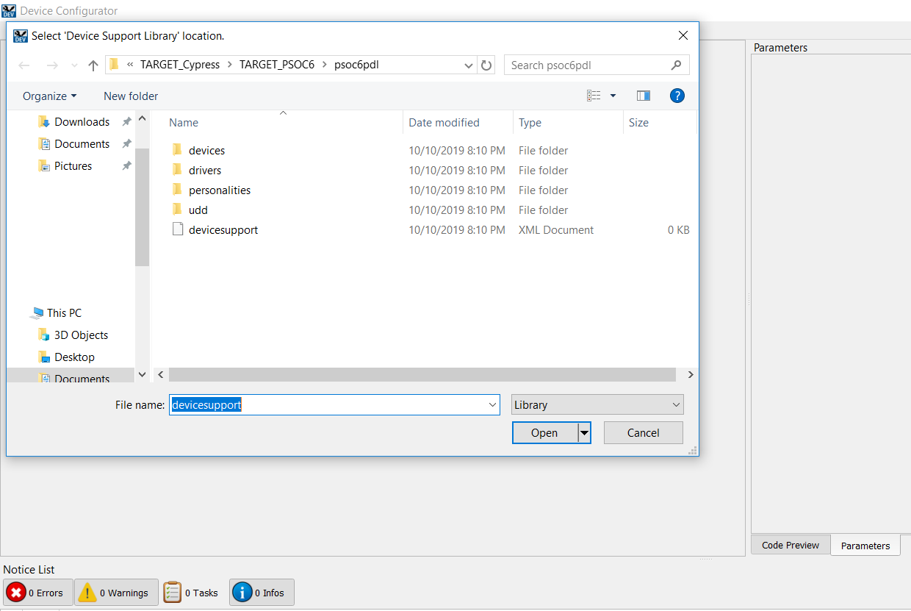

# PSoC 6 MCU: WLAN Packet Filter Offload

This code example demonstrates the Packet Filter Offload functionality offered by the Cypress WLAN device using PSoC® 6 MCU.  This allows the application to configure the desired WLAN network packets that can reach the network stack running on PSoC 6 MCU. It employs the [Low Power Assistant](#https://github.com/cypresssemiconductorco/lpa) (LPA) middleware library, which helps in developing low-power applications for Cypress devices.

Tested with Mbed OS v6.2.1.

## Requirements

- Programming Language: C/C++
- Associated Parts: All [PSoC® 6 MCU](http://www.cypress.com/PSoC6) parts
- [Mbed CLI](https://github.com/ARMmbed/mbed-cli)
- [ModusToolbox v2.1](https://www.cypress.com/documentation/software-and-drivers/modustoolbox-software-archives) or later

  **Note:** You do not need to install ModusToolbox to build and run this code example. However, installing it is required when you need to:

  * Debug using the Eclipse for ModusToolbox IDE. See the [user guide](https://www.cypress.com/MTBEclipseIDEUserGuide) for details.
  * Customize the default device configuration using any of the Configurator tools
  * Port this code example to a new target that is not listed under the **Supported Kits**

## Supported Toolchains (Mbed CLI argument `--toolchain`)

- [GNU Arm Embedded Compiler v9.2.1](https://developer.arm.com/open-source/gnu-toolchain/gnu-rm/downloads) (GCC_ARM)
- [Arm compiler v6.14](https://developer.arm.com/tools-and-software/embedded/arm-compiler/downloads/version-6) (ARM)

## Supported Kits (Mbed CLI argument `--target`)

- [PSoC 6 Wi-Fi BT Prototyping Kit](https://www.cypress.com/CY8CPROTO-062-4343W) (CY8CPROTO-062-4343W)
- [PSoC 62S2 Wi-Fi BT Pioneer Kit](https://www.cypress.com/CY8CKIT-062S2-43012) (CY8CKIT-062S2-43012)
- [PSoC 62 Wi-Fi BT Pioneer Kit](https://www.cypress.com/CY8CKIT-062-WIFI-BT) (CY8CKIT-062-WIFI-BT)
- [PSoC 6 Wi-Fi BT Prototyping Kit](https://www.cypress.com/CY8CPROTO-062S3-4343W) (CY8CPROTO-062S3-4343W)
- [PSoC 62S1 Wi-Fi BT Pioneer Kit](https://www.cypress.com/CYW9P62S1-43438EVB-01) (CYWP62S1-43438EVB-01)
- [PSoC 62S1 Wi-Fi BT Pioneer Kit](https://www.cypress.com/CYW9P62S1-43012EVB-01) (CYWP62S1-43012EVB-01)

## Hardware Setup

This example uses the board's default configuration. See the kit user guide to ensure that the board is configured correctly.

**Note:** The PSoC 6 BLE Pioneer Kit (CY8CKIT-062-BLE) and the PSoC 6 WiFi-BT Pioneer Kit (CY8CKIT-062-WIFI-BT) ship with KitProg2 installed. The ModusToolbox software requires KitProg3. Before using this code example, make sure that the board is upgraded to KitProg3. The tool and instructions are available in the [Firmware Loader](https://github.com/cypresssemiconductorco/Firmware-loader) GitHub repository. If you do not upgrade, you will see an error like "unable to find CMSIS-DAP device" or "KitProg firmware is out of date".

For Mbed OS, the kit must be in DAPLink mode. Refer the **KitProg3 User Guide** (Documentation tab in the [Cypress Programming Solutions](https://www.cypress.com/products/psoc-programming-solutions) web page) for details of how to put the Pioneer Kit into DAPLINK mode.

## Software Setup

- Install a terminal emulator such as [Tera Term](https://ttssh2.osdn.jp/index.html.en) or [PuTTY](https://www.putty.org/) if you don't have any.

- Install the *ARP'ing* network utility:
  - [Windows](https://www.elifulkerson.com/projects/arp-ping.php)
  - [macOS](http://macappstore.org/arping/)
  - On Linux, use the `sudo apt install arping` command. Most of the Ubuntu OS distributions have it natively available.

This example requires the [Device Configurator Tool](https://www.cypress.com/ModusToolboxDeviceConfig), which is installed as part of [ModusToolbox v2.1](https://www.cypress.com/documentation/software-and-drivers/modustoolbox-software-archives).

## Import the Code Example using Mbed CLI Tool

Mbed CLI commands are used to import the code example and compile. See [Working with Mbed CLI web page](https://os.mbed.com/docs/mbed-os/v6.2/tools/working-with-mbed-cli.html).

```
mbed import https://github.com/cypresssemiconductorco/mbed-os-example-wlan-offload-packet-filter
```

It first clones the code example repository from GitHub, and then deploys all the libraries. If you wish to perform the *deploy* process manually, follow the below commands:

Clone the GitHub code example repository:

```
git clone https://github.com/cypresssemiconductorco/mbed-os-example-wlan-offload-packet-filter && cd mbed-os-example-wlan-offload-packet-filter
```

Deploy the dependent libraries. The library files are identified with *.lib* extension.

```
mbed deploy
```

Set the current directory as *root*:

```
mbed new .
```

## Operation

1. Connect the board to your PC using the provided USB cable through the KitProg3 USB connector.

2. Open *mbed_app.json* and modify the `wifi-ssid`, `wifi-password`, and `wifi-security` macros to match the credentials of the Wi-Fi network that you want to connect to.

3. Ensure that your computer is connected to the same Wi-Fi access point that you configured in Step 2.

4. Program the board.

    ```
    mbed compile -m <TARGET> -t <TOOLCHAIN> --flash --sterm
    ```

    For instance, to build for the target `CY8CPROTO_062_4343W` with `GCC_ARM` toolchain, use the following command:

    ```
    mbed compile -m CY8CPROTO_062_4343W -t GCC_ARM --flash --sterm
    ```

    **Note:** With the `--sterm` option, Mbed CLI opens a new  terminal with 9600-8N1 as the setting after programming completes. Do not use this option if you want to connect using another serial terminal application such as PuTTY or Tera Term.

5. After programming, the application starts automatically. Verify that the application startup log shows the following fields:

    ```
    Info: =======================================
    Info: PSoC 6 MCU: Packet Filter Offload Demo
    Info: =======================================
    
    Info: SSID: WIFI_SSID, Security: 4
    Info: Connecting to Wi-Fi AP: WIFI_SSID
    WLAN MAC Address : A0:C9:A0:3D:D3:6A
    WLAN Firmware    : wl0: Jan 30 2020 21:41:53 version 7.45.98.95 (r724303 CY) FWID 01-5afc8c1e
    WLAN CLM         : API: 12.2 Data: 9.10.39 Compiler: 1.29.4 ClmImport: 1.36.3 Creation: 2020-01-30 21:30:05
    WHD VERSION      : v1.91.2 : v1.91.2 : GCC 9.2 : 2020-06-25 02:15:47 -0500
    Info: MAC        : a0:c9:a0:3d:d3:6a
    Info: Netmask    : 255.255.255.0
    Info: Gateway    : 192.168.0.1
    Info: RSSI       : -49
    
    Info: IP Addr    : 192.168.0.109
    
    Info: HTTP server started successfully. Go to the webpage http://192.168.0.109
    
    Network Stack Suspended, MCU will enter DeepSleep power mode
    ```

### Testing

1. Open the web browser of your choice and enter the IP address `http://<ip_address>/`.  This will open the home web page for the ARP Offload application.  The IP address can be obtained from the kit's console log.

   The page has two sections: **Active Packet Filters** and **Pending Packet Filters:** 

   **Figure 1. Packet Filter Home Web Page**

   

   **Active Packet Filters:**
   This section contains packet filters that are applied to the WLAN device and are currently active.
   
   1. Click **Restore defaults** to restore to default packet filter configuration. The default configuration is the one configured from the Device Configurator tool.

   **Pending Packet Filters:**

   This section contains packet filters that are not applied to the WLAN device yet and are in pending state.

   1. Click **Add Filter** to add a new packet filter into the pending filter list. This redirects to another web page with an interface to add a new packet filter to the pending filter list. Figure 2 to Figure 4 show the interface for various packet filter configuration.

     **Figure 2. Port Type Filter**

     

     **Figure 3. Eth Type Filter**

     

     **Figure 4. IP Type Filter**

     

   2. Click **Remove Last Filter** to remove the last applied packet filter from the pending list.

   3. Click **Import minimal keep filters** to import the default packet filter configuration into the pending list. This pulls the configuration from the Device Configurator generated settings. See [Configure Packet Filters](#configure-packet-filters) section for more details.

   4. Once the configuration is finalized in the pending list, click **Apply Filters** to apply the pending packet filters into the WLAN device. 

     The web page will go down temporarily as the kit reconnects to the AP to apply new packet filter configuration. This will overwrite the current configuration; the WLAN will be active with the new packet filter list.

   5. Refresh the home webpage and verify that the **Active Packet Filters** section has updated with the new configuration.

   Minimum keep filters that are configured via the Device Configurator tool are *ARP*, *DHCP*, *802.1X*, *DNS*, and *HTTP* packets in this application demonstration. This means that the kit will respond to only these network packets and toss (or discard) any other packet types trying to reach the host. The requesting device will time out waiting for response from the kit.

2. To verify the packet filter, send a `ping` request from your PC to the target kit. 

   Because the `ping` packet (ICMP type) is not configured to be allowed by the WLAN device, the ping request will time out and the packet will get tossed by the WLAN device. 

   ```
   $ ping 192.168.0.109
   Pinging 192.168.0.109 with 32 bytes of data:
   Request timed out.
   Request timed out.
   Request timed out.
   Request timed out.

   Ping statistics for 192.168.0.109:
       Packets: Sent = 4, Received = 0, Lost = 4 (100% loss),
   ```

3. Send an ARP request packet (0x806) to the kit. 

   Because the ARP packet type is configured to be allowed by default, the target kit will send an ARP response back with the valid host MAC address. This verifies the packet filtering works.

   ```
   $ arp-ping.exe 192.168.0.109
   Reply that A0:C9:A0:3D:D3:6A is 192.168.0.109 in 1114.724ms
   Reply that A0:C9:A0:3D:D3:6A is 192.168.0.109 in 1116.832ms
   Reply that A0:C9:A0:3D:D3:6A is 192.168.0.109 in 1114.330ms
   Reply that A0:C9:A0:3D:D3:6A is 192.168.0.109 in 1114.495ms

   Ping statistics for 192.168.0.109/arp
        4 probes sent.
        4 successful, 0 failed.
   Approximate trip times in milli-seconds:
        Minimum = 1114.330ms, Maximum = 1116.832ms, Average = 1115.095ms
   ```

   To send the `arp-ping` command every 'x' seconds, use the following command:

   ```
   $ arp-ping -i X <IP address of the target kit>
   ```
   where `i` denotes the interval; ARP request packets will be sent every `X` seconds.

4. Add the **Ping** packet filter to verify that the peer device in the network is able to ping the kit successfully. Do the following to allow the `ping` packet.

   1. Click **Import minimal keep filters**. This will import the required [minimum packet filters](#minimum-allowed-packet-types) necessary for the application.
   
   2. Click **Add Filter**. Add the following configuration and click **Submit**.

     ```
     Filter Type:   IP Type
     Action     :   Keep
     IP Protocol:   1
     ```

5. Verify that the new filter is added to the pending list. 

   1. Click **Apply Filters**. 
   
      The kit will now re-associate to AP. 
      
   2. Refresh the web page. Now, any device in the same network as the kit can send a ping request and get a response.

    ```
    $ ping 192.168.0.109
    
    Pinging 192.168.0.109 with 32 bytes of data:
    Reply from 192.168.0.109: bytes=32 time=411ms TTL=255
    Reply from 192.168.0.109: bytes=32 time=361ms TTL=255
    Reply from 192.168.0.109: bytes=32 time=435ms TTL=255
    Reply from 192.168.0.109: bytes=32 time=176ms TTL=255
    
    Ping statistics for 192.168.0.109:
        Packets: Sent = 4, Received = 4, Lost = 0 (0% loss),
    Approximate round trip times in milliseconds:
        Minimum = 176ms, Maximum = 435ms, Average = 345ms
    ```

**Notes**

- The code example disables the default device configuration provided in *mbed-os\targets\TARGET_Cypress\TARGET_PSOC6\TARGET\COMPONENT_BSP_DESIGN_MODUS* with the one provided in *COMPONENT_CUSTOM_DESIGN_MODUS/TARGET_\<kit>/*. The custom configuration disables the Phase-locked Loop (PLL), and the HF clock to unused peripherals such as audio/USB, and configures the Buck regulator instead of the Low Dropout (LDO) regulator to power the PSoC 6 MCU device. This configuration reduces the current consumed by the PSoC 6 MCU device in active state with a small increase in deep sleep current. Enable the peripherals using Device Configurator.

- Clicking the **Apply Filters** or **Restore defaults** on the HTTP web page will cause re-association with the AP. During this time, the web page will keep loading and eventually stop without loading the web page. Refresh the web page with the URL `http://<IP address of the target kit>` to get the web page back.

## Debugging

You can debug the example to step through the code. In the IDE, use the **\<Application Name> Debug (KitProg3_MiniProg4)** configuration in the **Quick Panel**. For more details, see the "Program and Debug" section in the [Eclipse IDE for ModusToolbox User Guide](https://www.cypress.com/MTBEclipseIDEUserGuide).

Follow the steps from [Eclipse IDE for ModusToolbox User Guide](https://www.cypress.com/MTBEclipseIDEUserGuide#page=23) to export the Mbed OS code example and import it into ModusToolbox IDE for programming and debugging.

Mbed OS also supports debugging using any IDE that supports GDB. We recommend the user to go through [ARM Mbed's documentation](https://os.mbed.com/docs/mbed-os/v6.2/debug-test/index.html) on the debugging steps.

**Note:** **(Only while debugging)** On the CM4 CPU, some code in `main()` may execute before the debugger halts at the beginning of `main()`. This means that some code executes twice - before the debugger stops execution, and again after the debugger resets the program counter to the beginning of `main()`. See [KBA231071](https://community.cypress.com/docs/DOC-21143) to learn about this and for the workaround.

## Design and Implementation

The packet filter helps to filter out unwanted network packets from reaching the host MCU (PSoC 6 MCU) and waking it up from deep sleep if it was sleeping. This helps the host to stay in deep sleep for longer periods of time. WLAN network packets can be filtered based on the port (at application layer in OSI model), IP protocol type (transport layer), or Ether Type (network layer).

The Internet Assigned Numbers Authority (IANA) is responsible for maintaining the official assignments of port numbers, protocol numbers, or Ether type for WLAN packets. See the [IANA Protocols Registry](https://www.iana.org/protocols) for information on protocol numbers.

Figure 5 shows the packet filters Supported, based on a standard IP Stack.

**Figure 5. Packet Filters Supported**


**Figure 6. Packet Filter Enabled vs Disabled**


For more details on the implementation, see the [Low Power Assistant Reference Manual](https://cypresssemiconductorco.github.io/lpa/lpa_api_reference_manual/html/index.html#group_lpa_p2_packet_filter).

The application does the following when the kit is powered up:

1. Initializes Wi-Fi as a STA (Station) interface.

2. Initializes the OLM (Offload Manager) with the configuration present in the *GeneratedSources* folder inside *COMPONENT_CUSTOM_DESIGN_MODUS/TARGET_\<kit>*, where the source code for the feature is generated by the Device Configurator tool. The Offload Manager will be initialized based on the GeneratedSources configuration.

3. Connects to the AP with the Wi-Fi credentials in the *mbed_app.json* file.

4. Starts the HTTP web server.

This application uses a "Ping-Pong" buffer logic. One of the buffers is used to hold the *Active packet filters* configuration that is applied to the WLAN device. The other buffer is used to keep track of the *Pending packet filters* which you can add to the list and apply the configuration.

**Figure 7. Ping Pong Buffer**


### Configure Packet Filters

Use the ModusToolbox Device Configurator tool to configure packet filters and the host MCU wake pin. By default, Mbed OS is shipped with a *design.modus* file that can be used to configure the kit's peripherals from scratch as per application requirement.

In this application, a pre-configured *design.modus* file is provided for each target *TARGET_\<kit>*. This has all the necessary settings enabled for the feature to work. We recommend that you go through the following steps. It provides additional information on how to access the *design.modus* file and configure packet filters using the ModusToolbox Device Configurator tool.

**Note:** The steps in this section are already handled with this application. They are provided only for informational purposes.

1. Open the Device Configurator tool from the ModusToolbox installation directory: *<mtb_install_dir>\ModusToolbox\tools_2.x\device-configurator*.

2. Click **File** > **Open** and select the *design.modus* file in the current example directory for the target kit, in *\<code-example-installed-dir\>/COMPONENT_CUSTOM_DESIGN_MODUS/TARGET_\<kit>/design.modus*.

   If the *design.modus* file does not open, and the error message *No device support library path provided* appears, browse to the *psoc6pdl* folder inside the *mbed-os* directory as shown in Figure 9. The path should look like as follows: *mbed-os-example-wlan-offload-packet-filter\mbed-os\targets\TARGET_Cypress\TARGET_PSOC6\psoc6pdl*. This is because the *design.modus* file will update its path to the PDL directory when it is opened for the first time.

   **Figure 8. Error Opening design.modus File**

   

   **Figure 9. Set Path to psoc6pdl**

   

3. Configure Packet Filter Offload by following the steps provided in the
    [Quick Start Guide](https://cypresssemiconductorco.github.io/lpa/lpa_api_reference_manual/html/index.html#group_lpa_p2_packet_filter_qsg).
    This is also available locally: *\<code-example-installed-dir\>/lpa/docs/lpa_api_reference_manual.html*.

4. On the **PSoC6 MCU Pins** tab of the Device Configurator tool, do the following:

    - **CY8CKIT_062_WIFI_BT**
        - Enable the host WAKE pin **P2[7]** and name it *CYBSP_WIFI_HOST_WAKE*.
        - In the **Parameters** pane, change the following.
            - **Drive Mode:** Analog High-Z. Input buffer off.
            - **Initial Drive State:** High(1).
            - **Interrupt Trigger Type:** Rising Edge.
        

    - **CY8CKIT_062S2_43012**
        - Enable the host WAKE pin **P4[1]** and name it *CYBSP_WIFI_HOST_WAKE*.
        - In the **Parameters** pane, change the following.
            - **Drive Mode:** Analog High-Z. Input buffer off.
            - **Initial Drive State:** High(1).
            - **Interrupt Trigger Type:** Rising Edge.
        

    - **CY8CPROTO_062_4343W**
        - Enable the host WAKE pin **P0[4]** and name it *CYBSP_WIFI_HOST_WAKE*.
        - In the **Parameters** pane, change the following.
            - **Drive Mode:** Analog High-Z. Input buffer off.
            - **Initial Drive State:** High(1).
            - **Interrupt Trigger Type:** Rising Edge.
        
        
        **Note:** The Wi-Fi host driver takes care of the drive mode configuration of the host WAKE pin.

5. Go to the tab for the connectivity device and configure the fields as follows. The following configuration is applicable to all the [supported kits](#supported-kits).
   
     1. Enable Host Wake Configuration and set **Host Device Interrupt Pin** to **CYBSP_WIFI_HOST_WAKE**.
     
     2. Select **Add Minimal Set of Keep Filters**. This adds minimum required packet filters for a basic network application to work. Here, packets filters configured to be allowed are *ARP*, *802.1X* (for LAN and WLAN authentication), *DHCP*, and *DNS* packets.
     
     3. In addition to these, you need the HTTP packet filter since this code example uses HTTP web server as the user interface. So add **HTTP port 80** as the packet filter as shown in Figure 11.

        **Figure 10. Wi-Fi Configuration**

        

        **Figure 11. Packet Filter Configuration**

        

6. Select **File** > **Save**.

     The generated source files *cycfg_connectivity_wifi.c* and *cycfg_connectivity_wifi.h* will be in the *GeneratedSource* folder, which is present in the same location from where you opened the *design.modus* file.

### Minimum Allowed Packet Types

When using keep filters, you must allow enough packets through for networking protocols to work properly. For example, PSoC 6 MCU running the application must be able to join a network, get a DHCP address, run ARP, and possibly share network security keys. Not creating enough *Keep* filters to allow all these type of packets through will prevent the MCU from joining the network. A reasonable minimal set of *Keep* filters are:

    Keep, EtherType 0x806                    # Allow ARP
    Keep, EtherType 0x888e                   # Allow 802_1X Security
    Keep, Port Filter: UDP, Dest Port 68     # Allow DHCP
    Keep, Port Filter: UDP, Source Port 53   # Allow DNS

This code example uses an HTTP web server to host the web page for user access, so you need an additional packet filter to allow HTTP packets to reach the host MCU for its service: 

    Keep, Port Filter: TCP, Dest Port 80     # Allow HTTP

## Related Resources

| Application Notes                                            |                                                              |
| :----------------------------------------------------------- | :----------------------------------------------------------- |
| [AN227640](https://cypresssemiconductorco.github.io/cypress-mbed-os-docs/) – Getting Started with PSoC 6 MCU and CYW43xxx in Mbed OS | Describes PSoC 6 MCU devices and how to build your first application with Mbed OS. |
| [AN227910](http://www.cypress.com/AN227910) – AN227910 - Low-Power System Design with CYW43012 and PSoC 6 MCU | Describes how to implement a low-power system design.        |
| **Code Examples**                                            |                                                              |
| [Using Mbed OS](https://github.com/cypresssemiconductorco?q=mbed-os-example%20NOT%20Deprecated) |                                                              |
| [Using ModusToolbox](https://github.com/cypresssemiconductorco/Code-Examples-for-ModusToolbox-Software) | [Using PSoC Creator](https://www.cypress.com/documentation/code-examples/psoc-6-mcu-code-examples) |
| **Device Documentation**                                     |                                                              |
| [PSoC 6 MCU Datasheets](https://www.cypress.com/search/all?f[0]=meta_type%3Atechnical_documents&f[1]=resource_meta_type%3A575&f[2]=field_related_products%3A114026) | [PSoC 6 Technical Reference Manuals](https://www.cypress.com/search/all/PSoC%206%20Technical%20Reference%20Manual?f[0]=meta_type%3Atechnical_documents&f[1]=resource_meta_type%3A583) |
| **Development Kits**                                         | Buy at www.cypress.com                                       |
| [CY8CKIT-062S2-43012 PSoC 62S2 WiFi-BT Pioneer Kit](http://www.cypress.com/CY8CKIT-062S2-43012) | [CY8CKIT-062-WiFi-BT PSoC 6   WiFi-BT Pioneer Kit](http://www.cypress.com/CY8CKIT-062-WiFi-BT) |
| [CY8CPROTO-062-4343W   PSoC 6 Wi-Fi BT Prototyping Kit](http://www.cypress.com/CY8CPROTO-062-4343w) | [CY8CPROTO-062S3-4343W PSoC 6   WiFi-BT Pioneer Kit](http://www.cypress.com/CY8CPROTO-062S3-4343W) |
| [CYW9P62S1-43438EVB-01](https://www.cypress.com/CYW9P62S1-43438EVB-01) PSoC 62S1 Wi-Fi BT Pioneer Kit | [CYW9P62S1-43012EVB-01](https://www.cypress.com/CYW9P62S1-43012EVB-01) PSoC 62S1 Wi-Fi BT Pioneer Kit |                                                             |
| **Libraries**                                                 |                                                              |
| PSoC 6 Peripheral Driver Library (PDL) and docs  | [psoc6pdl](https://github.com/cypresssemiconductorco/psoc6pdl) on GitHub |
| Cypress Hardware Abstraction Layer (HAL) Library and docs     | [psoc6hal](https://github.com/cypresssemiconductorco/psoc6hal) on GitHub |
| **Middleware**                                               |                                                              |
| Low Power Assistant (LPA)                                    | [lpa](https://github.com/cypresssemiconductorco/lpa) on GitHub |
| HTTP Server                                                  | [http-server](https://github.com/cypresssemiconductorco/http-server) on GitHub |
| Connectivity-Utilities                                       | [connectivity-utilities](https://github.com/cypresssemiconductorco/connectivity-utilities) on GitHub |
| Links to all PSoC 6 MCU Middleware                           | [psoc6-middleware](https://github.com/cypresssemiconductorco/psoc6-middleware) on GitHub |
| **Tools**                                                    |                                                              |
| [Eclipse IDE for ModusToolbox](https://www.cypress.com/modustoolbox)     | The cross-platform, Eclipse-based IDE for IoT designers that supports application configuration and development targeting converged MCU and wireless systems.             |
| [PSoC Creator™](https://www.cypress.com/products/psoc-creator-integrated-design-environment-ide) | The Cypress IDE for PSoC and FM0+ MCU development.            |

## Other Resources

Cypress provides a wealth of data at www.cypress.com to help you select the right device, and quickly and effectively integrate it into your design.

For PSoC 6 MCU devices, see [How to Design with PSoC 6 MCU - KBA223067](https://community.cypress.com/docs/DOC-14644) in the Cypress community.

## Document History

Document Title: *CE229166* - *PSoC 6 MCU: WLAN Packet Filter Offload*

| Version |                 Description of Change              |
| -------- | -------------------------------------------------- |
|  1.0.0   |   Initial release.<br/>Tested with Mbed OS v5.14.2 and LPA middleware v1.0.0 |
|  1.1.0   |   Modified folder structure. |
|  2.0.0   |   Updated to Mbed OS v6.2.1 and LPA middleware v3.0.0  |

------

All other trademarks or registered trademarks referenced herein are the property of their respective owners.


-------------------------------------------------------------------------------

© Cypress Semiconductor Corporation, 2020. This document is the property of Cypress Semiconductor Corporation and its subsidiaries ("Cypress"). This document, including any software or firmware included or referenced in this document ("Software"), is owned by Cypress under the intellectual property laws and treaties of the United States and other countries worldwide. Cypress reserves all rights under such laws and treaties and does not, except as specifically stated in this paragraph, grant any license under its patents, copyrights, trademarks, or other intellectual property rights. If the Software is not accompanied by a license agreement and you do not otherwise have a written agreement with Cypress governing the use of the Software, then Cypress hereby grants you a personal, non-exclusive, nontransferable license (without the right to sublicense) (1) under its copyright rights in the Software (a) for Software provided in source code form, to modify and reproduce the Software solely for use with Cypress hardware products, only internally within your organization, and (b) to distribute the Software in binary code form externally to end users (either directly or indirectly through resellers and distributors), solely for use on Cypress hardware product units, and (2) under those claims of Cypress's patents that are infringed by the Software (as provided by Cypress, unmodified) to make, use, distribute, and import the Software solely for use with Cypress hardware products. Any other use, reproduction, modification, translation, or compilation of the Software is prohibited.  
TO THE EXTENT PERMITTED BY APPLICABLE LAW, CYPRESS MAKES NO WARRANTY OF ANY KIND, EXPRESS OR IMPLIED, WITH REGARD TO THIS DOCUMENT OR ANY SOFTWARE OR ACCOMPANYING HARDWARE, INCLUDING, BUT NOT LIMITED TO, THE IMPLIED WARRANTIES OF MERCHANTABILITY AND FITNESS FOR A PARTICULAR PURPOSE. No computing device can be absolutely secure. Therefore, despite security measures implemented in Cypress hardware or software products, Cypress shall have no liability arising out of any security breach, such as unauthorized access to or use of a Cypress product. CYPRESS DOES NOT REPRESENT, WARRANT, OR GUARANTEE THAT CYPRESS PRODUCTS, OR SYSTEMS CREATED USING CYPRESS PRODUCTS, WILL BE FREE FROM CORRUPTION, ATTACK, VIRUSES, INTERFERENCE, HACKING, DATA LOSS OR THEFT, OR OTHER SECURITY INTRUSION (collectively, "Security Breach"). Cypress disclaims any liability relating to any Security Breach, and you shall and hereby do release Cypress from any claim, damage, or other liability arising from any Security Breach. In addition, the products described in these materials may contain design defects or errors known as errata which may cause the product to deviate from published specifications. To the extent permitted by applicable law, Cypress reserves the right to make changes to this document without further notice. Cypress does not assume any liability arising out of the application or use of any product or circuit described in this document. Any information provided in this document, including any sample design information or programming code, is provided only for reference purposes. It is the responsibility of the user of this document to properly design, program, and test the functionality and safety of any application made of this information and any resulting product. "High-Risk Device" means any device or system whose failure could cause personal injury, death, or property damage. Examples of High-Risk Devices are weapons, nuclear installations, surgical implants, and other medical devices. "Critical Component" means any component of a High-Risk Device whose failure to perform can be reasonably expected to cause, directly or indirectly, the failure of the High-Risk Device, or to affect its safety or effectiveness. Cypress is not liable, in whole or in part, and you shall and hereby do release Cypress from any claim, damage, or other liability arising from any use of a Cypress product as a Critical Component in a High-Risk Device. You shall indemnify and hold Cypress, its directors, officers, employees, agents, affiliates, distributors, and assigns harmless from and against all claims, costs, damages, and expenses, arising out of any claim, including claims for product liability, personal injury or death, or property damage arising from any use of a Cypress product as a Critical Component in a High-Risk Device. Cypress products are not intended or authorized for use as a Critical Component in any High-Risk Device except to the limited extent that (i) Cypress's published data sheet for the product explicitly states Cypress has qualified the product for use in a specific High-Risk Device, or (ii) Cypress has given you advance written authorization to use the product as a Critical Component in the specific High-Risk Device and you have signed a separate indemnification agreement.  
Cypress, the Cypress logo, Spansion, the Spansion logo, and combinations thereof, WICED, PSoC, CapSense, EZ-USB, F-RAM, and Traveo are trademarks or registered trademarks of Cypress in the United States and other countries. For a more complete list of Cypress trademarks, visit cypress.com. Other names and brands may be claimed as property of their respective owners.
